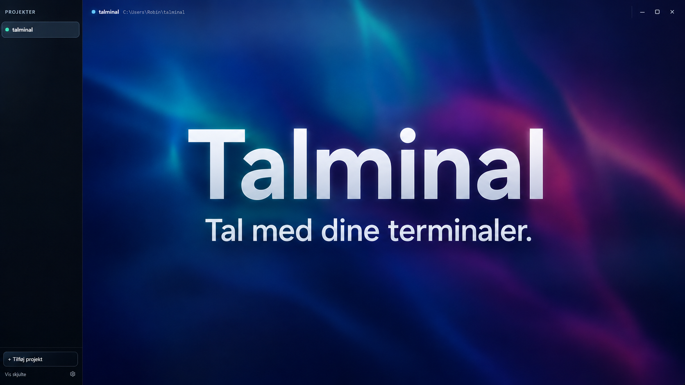
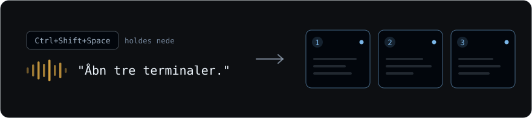
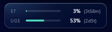

<div align="center"><a name="readme-top"></a>



# Talminal

**Tal med dine terminaler.**<br/>
Et canvas af agent-terminaler — Claude Code og Codex CLI — som du styrer med stemmen.<br/>
Kun til 

[![][license-shield]][license-link]
![][windows-shield]
[![][tauri-shield]][tauri-link]
[![][rust-shield]][rust-link]
![][voice-shield]
[![][pr-welcome-shield]][pr-welcome-link]<br/>
[![][ci-shield]][ci-link]
[![][github-stars-shield]][github-stars-link]
[![][github-forks-shield]][github-forks-link]
[![][github-contributors-shield]][github-contributors-link]
[![][github-issues-shield]][github-issues-link]
[![][github-last-commit-shield]][github-last-commit-link]

</div>

<!--
HERO: `assets/hero.png` — en genereret gengivelse af brugerfladen, ikke et
skærmbillede. Proveniens, rettighedsgrundlag og hvad billedet indeholder står i
ASSETS.md. En demo-GIF af den kørende app er stadig ønsket, men hører efter v0.1.
-->

---

##  Sådan virker det

Canvas'et er et gitter af **nummererede kort**. Hvert kort er en rigtig agent-terminal —
Claude Code eller Codex CLI — og **nummeret er det du taler til.**



<sub>Prikken på hvert kort er dets tilstand. Farverne er appens egne, og de betyder det samme her som inde i produktet: blå starter · teal kører · rav venter på dig · rød fejlet.</sub>

Hold **`Ctrl+Shift+Space`** nede, sig din kommando, slip. Genvejen kan ændres under
Indstillinger → Stemme. Stemmen er en genvej, ikke en betingelse: et kort kan også oprettes
med musen ved at **dobbeltklikke på tom canvasflade.**

Canvas **starter altid tomt.** Dine projektfiler og agenternes egne tråde overlever, men
korttopologien gendannes ikke — det er en udtalt kontrakt, ikke en fejl.

### Kortet har fire navne

Du skal ikke huske ét bestemt ord. **`kort`**, **`terminal`**, **`agent`** og **`canvas`**
betyder præcis det samme, når der står et nummer efter:

| Du siger | Den hører |
|---|---|
| *"Luk kort to."* | luk kort 2 |
| *"Luk agent to."* | luk kort 2 |
| *"Luk canvas to."* | luk kort 2 |
| *"Genstart terminal fire."* | genstart kort 4 |

Ordvalget ændrer aldrig kommandoen — kun tallet udpeger kortet.

To undtagelser er værd at kende:

- **`canvas` uden et tal** er selve fladen, ikke alle kort. *"Luk canvas"* lukker derfor
  ingenting — den spørger hvilket kort du mener. Kun ordet **"alle"** rammer alle:
  *"Luk alle kort."*
- **I en oprettelse navngiver `agent` modellen**, ikke et kort: *"Åbn et kort med agent
  codex"* giver ét Codex-kort.

### De fem ting du kan sige

| | Eksempel |
|---|---|
| **Opret kort** | *"Åbn tre terminaler."* · *"Nyt codex-kort."* |
| **Send en besked** | *"Send til kort et: kør testene."* · *"Spørg kort tre hvor langt den er."* |
| **Luk kort** | *"Luk kort to og tre."* · *"Luk alle kort."* |
| **Genstart et kort** | *"Genstart kort fire."* |
| **Åbn en browser** | *"Åbn en browser på GitHub."* |

Nævner du hverken `claude` eller `codex`, bruges din standard-agent — `claude`, indtil du
ændrer den. Andre modelord (`gpt`, `gemini`) vælger ikke en agent; de falder tilbage til
standarden.

**Du kan kæde dem sammen,** og de udføres i den rækkefølge du sagde dem: *"Luk kort to og
genstart kort tre."* Højst ti kommandoer og ti nye kort pr. sætning.

### Hvad den med vilje ikke gør

Den siger hellere fra end at gætte:

- **Spørgsmål uden et sende-verbum.** *"Hvad laver kort tre?"* gør ingenting — det er ikke
  en kommando. Sig *"Spørg kort tre hvad den laver"*, så bliver det en besked til kortet.
- **Fokus og navigation.** *"Gå til kort fem"* og *"zoom ind"* findes ikke som stemmekommandoer.
- **Mapper og projektnavne.** *"Nyt kort i webshop-mappen"* afvises. Canvas'et **er**
  projektet, og den gætter aldrig en placering.
- **Rettelser midt i en sætning.** *"Genstart… nej, luk kort tre"* afvises som helhed frem
  for at udføre halvdelen. Sig det forfra.

Er den ikke sikker nok på hvad du sagde, gør den ingenting i stedet for noget forkert.

### Når to agenter skal sparre

Et kort kan hente et andet kort ind som sparringspartner. Agenten gør det selv gennem
**Talminals egen MCP-server**, som er registreret hos begge agenter under navnet
**`talminal`**. Den giver dem syv værktøjer: fire til browser-kort og tre til at tale
sammen — `card_pair`, `card_say` og `card_inbox`.

**Skriv det ind i din prompt.** Din agent har som regel flere veje der *lyder* rigtige —
Playwrights egne faner, Claude in Chrome, eller bare at skrive i sin egen terminal — og
vælger den en af dem, sker der ingenting du kan se. Så vær eksplicit:

> *"Par dig med et codex-kort gennem `talminal`-MCP'en og spar med den om X. Svar med
> `card_say`, og læs dens svar med `card_inbox`."*

Det samme gælder browsere: bed den om at åbne et **browser-kort** frem for at bruge sine
egne fane-værktøjer. Værktøjsbeskrivelserne siger det allerede til agenten, men en linje i
din egen prompt fjerner tvivlen.

Grænserne, så du ikke undrer dig over dem undervejs:

- **To partnerkort pr. app-session**, talt kumulativt — lukker du ét, får du ikke pladsen
  tilbage. Et kort der selv blev oprettet af en parring, må ikke parre videre.
- **20 hop pr. tråd** mellem agenterne. Dine egne beskeder tæller ikke med.
- **En ubesvaret delegation udløber** — efter fem minutters stilstand, og senest efter tyve.
- Svarer en agent i sin egen terminal i stedet for gennem tråden, **når det ingen.**

##  Installation

```powershell
# Prøv den — kør fra den projektmappe du vil arbejde i
npx talminal

# Behold den
npm i -g talminal
```

Kør kommandoen **fra en projektmappe**. Talminal finder projektroden (nærmeste `.git`) og
åbner et canvas for netop det repo. Kører du den et andet sted, får du et canvas for det
sted.

Kræver **Windows 11 x64** — `os`/`cpu` i pakken gør en install på andre platforme til en
ren fejl frem for en app der ikke virker.

### Opdatering

Der er **ingen auto-update og ingen notifikation** — appen siger ikke selv til når
der er kommet en nyere version. Du henter den:

```powershell
npm i -g talminal@latest    # hvis du installerede globalt
npx talminal@latest         # npx cacher, så uden @latest kan du køre en gammel
```

Nye versioner annonceres under [Releases](https://github.com/RWitzner/talminal/releases).
En automatisk opdateringsvej er fravalgt til v0.1 — se de kendte mangler nederst.

### Byg fra kilde

```powershell
git clone https://github.com/RWitzner/talminal.git
cd talminal
npm ci
npm run tauri dev
```

Første byg tager nogle minutter — `rust-toolchain.toml` får `rustup` til at hente den
pinnede toolchain, og Rust-siden skal kompileres helt.

##  Forudsætninger

| Krav | Noter |
|---|---|
| **Windows 11 x64** | Kun Windows. ConPTY, Credential Manager og WebView2 er alle i den kritiske sti. |
| **WebView2** | Følger med Windows 11. Testet mod 151.0.4129.59. |
| **Node + npm** | Versionen står i `.nvmrc` (testet: Node 24.15.0, npm 11.5.2). **Node er også et runtime-krav**, ikke kun et byggeværktøj: browser-kort starter `npx @playwright/mcp` mens appen kører. |
| **Rust** | Versionen er pinnet i `rust-toolchain.toml`. Kun nødvendig hvis du bygger fra kilde. |
| **C++ Build Tools** (MSVC) | Til at linke Rust-siden. Kun ved byg fra kilde. |
| **Claude Code CLI** | Testet mod **2.1.220**. |
| **Codex CLI** | **Valgfri.** Testet mod **0.145.0**. Bruger du kun Claude-kort, behøver du den ikke — og så sendes der intet til OpenAI ad den vej. |
| **Mikrofon-tilladelse** | Kun til stemmestyring. Windows' privatlivsindstilling skal tillade mikrofonadgang; ingen app kan omgå den. |

Appen starter fint **uden nogen nøgler**. Kort, terminaler og browser-kort virker; det er
kun stemmevejen der beder om noget.

##  Nøgler (BYOK)

Talminal har ingen konto og ingen server. Du indtaster dine egne nøgler under
**Indstillinger → Nøgler**, og de gemmes i Windows Credential Manager — ikke i en fil.
Selve rute-valget står under **Model & routing**.

### Den korte opskrift

Stemmevejen har to trin, og de kan bruge **den samme nøgle**:

1. **Tale-til-tekst** kræver altid en **OpenAI-nøgle**.
2. **Router-modellen**, der forstår hvad du sagde, kan bruge fire ruter. Vælg én:

| Rute | Du skal bruge | Målt p50 |
|---|---|---|
| `vercel` — **standard** | OpenAI-nøgle **+** Vercel AI Gateway-nøgle | 774 ms |
| `openrouter` | OpenAI-nøgle **+** OpenRouter-nøgle | — |
| `google` | OpenAI-nøgle **+** Google AI-nøgle | 680 ms |
| `openai` | **Kun** OpenAI-nøglen | 1322 ms |

**Vil du nøjes med én nøgle, så vælg `openai`-ruten.** Tale-til-tekst og routeren deler
nøgle-slot, så én OpenAI-nøgle dækker hele stemmevejen. Afvejningen er ærlig: den er
omkring dobbelt så langsom som standardruten — 1,3 s mod 0,77 s i median. Begge scorede
41/41 i eval-suiten, så det er hastighed, ikke præcision, der adskiller dem.

**Bemærk på standardruten:** `vercel` affyrer et andet skud efter 1200 ms, hvis det første
ikke er svaret endnu. Det giver lejlighedsvis to fakturerbare requests pr. ytring. De
øvrige ruter gør det ikke. Se [PRIVACY.md](docs/PRIVACY.md).

##  Statusline-tap (valgfri)



Vil du se Claude Codes forbrugsprocenter i canvas'ens HUD, kan du installere en tap:

```powershell
node statusline-tap/install.mjs
```

**Læs hvad den gør, før du kører den.** Den **skriver i din globale
`~/.claude/settings.json`** og peger `statusLine` på sig selv. Din hidtidige statusline
forsvinder ikke — den gemmes som delegat og kaldes uændret ved hvert tick. Der tages
backup af filen første gang, og `node statusline-tap/install.mjs --uninstall` ruller
ændringen tilbage.

Kører du aldrig kommandoen, rører intet i dette repo din `settings.json`.

##  Hvad du skal vide, før du kører den

- **Et kort er ikke en sandkasse.** Agenten får præcis samme adgang som en terminal åbnet
  i det workspace. Talminal sender heller ingen tilladelses-flag til agenterne, så de
  kører under **din egen** konfiguration — også hvis du har sat dem permissivt op.
  [SECURITY.md](.github/SECURITY.md) skriver det ud.
- **Hvad der sendes hvorhen** står i [PRIVACY.md](docs/PRIVACY.md). Kort: din stemme til
  OpenAI, transskriptet til den rute du valgte, dine prompts til agentens egen udbyder.
  Ingen telemetri.
- **Usigneret binær.** Kommer du til at hente en ZIP i stedet for at bruge npm, kan
  SmartScreen advare. npm-udpakkede filer bærer ikke Mark-of-the-Web, så den vej rammer
  det ikke.

##  Kendte mangler i v0.1

Et samarbejds-repo må gerne have en TODO-liste — det er en invitation, ikke en skam. Her er
det du kommer til at savne, så du ikke bruger en aften på at lede efter det:

- **Canvas starter altid tomt.** Det er en kontrakt, ikke en fejl: projektfiler og agenternes
  egne tråde overlever, men korttopologi og layout genskabes ikke. Lukkede du med tolv kort
  oppe, er de væk næste gang.
- **Tråde kan ikke slettes fra UI'et.** `threads\<id>.jsonl` er append-only og roterer ikke.
  Vil du rydde op, sletter du filerne manuelt mens appen er lukket.
- **Ingen afinstallations-handling.** [PRIVACY.md](docs/PRIVACY.md) lister hvad appen efterlader,
  men der er intet script og ingen knap der rydder det.
- **Ingen status-liste over forudsætninger.** Mangler `claude.exe`, en nøgle eller en
  mikrofon, får du en fejl når du rammer den — ikke en oversigt der siger det på forhånd.
- **Første browser-kort kræver netværk.** Det starter `npx @playwright/mcp@0.0.78`, som
  hentes fra npm første gang. Fejler det, sker det inde i agentens MCP-lag, og Talminal
  siger ikke selv noget om det.
- **Ingen auto-update.** Appen tjekker ikke om der er kommet en nyere version og siger
  ikke selv til. Du opdaterer manuelt med `npm i -g talminal@latest`. En updater er
  fravalgt til v0.1 og hører i v0.2.
- **Sikkerhedsmangler** står for sig i [SECURITY.md](.github/SECURITY.md) med konsekvensen af hver
  enkelt — læs den, ikke kun denne liste.

##  Dokumentation

| | |
|---|---|
| [ARCHITECTURE.md](docs/ARCHITECTURE.md) | Ét kort over kodebasen — start her |
| [CONTRIBUTING.md](.github/CONTRIBUTING.md) | Ritualet, sprogreglen, PR-forventninger |
| [SECURITY.md](.github/SECURITY.md) | Trusselsmodellen og hvordan du rapporterer |
| [PRIVACY.md](docs/PRIVACY.md) | Dataflow, retention, hvad der bliver liggende |
| [SUPPORT.md](.github/SUPPORT.md) | Spørgsmål og de hyppigste årsager |
| [ASSETS.md](ASSETS.md) | Medieaktiver og deres rettighedsgrundlag |

##  Licens

[Apache License 2.0](LICENSE) — se også [NOTICE](NOTICE).

**Lydklippene er undtaget.** De 15 ElevenLabs-genererede klip i `public/reply-clips/` og
`src/assets/` er købt med kommerciel brugsret og **sublicenseres ikke** under Apache-2.0.
Du kan regenerere dem under din egen konto med det medfølgende script. Se
[ASSETS.md](ASSETS.md).

---

<sub>Talminal — *tal* (imperativ af "at tale") + *terminal*. Talk to your terminals.</sub>

<!--
Reference-link-definitioner.

Farverne er appens egne, taget fra `src/`, og de BETYDER noget i koden:
7ab6e8 blå = starter · 4dd6b7 teal = kører · e8b046 rav = venter på dig ·
e06058 rød = fejlet (WorkspaceRail.tsx:358-369, UsageHud.tsx:68-71,
Settings.tsx:295-298). Dertil 9eafc1 og 718297 stål, 8fa7e0 periwinkle.

0a1220 er IKKE en app-farve. Den findes kun i denne fil, som mørk bagbund på
badges. Appens egne mørke er 0d0f12 (canvasfladen, App.tsx:1274) og 02060c
(kortets terminal, Card.tsx:259) — brug DEM hvis du tegner nye aktiver.

RAEKKE 1 er statisk og render altid. RAEKKE 2 spoerger GitHubs API og render
foerst naar repoet er offentligt — indtil da viser de "repo not found".
-->

[license-link]: https://github.com/RWitzner/talminal/blob/main/LICENSE
[license-shield]: https://img.shields.io/badge/license-Apache--2.0-9eafc1?style=flat-square&labelColor=0a1220

[windows-shield]: https://img.shields.io/badge/Windows%2011-x64-7ab6e8?style=flat-square&labelColor=0a1220

[tauri-link]: https://tauri.app
[tauri-shield]: https://img.shields.io/badge/Tauri-2-4dd6b7?style=flat-square&labelColor=0a1220&logo=tauri&logoColor=edf5fc

[rust-link]: https://www.rust-lang.org
[rust-shield]: https://img.shields.io/badge/rust-1.89-e8b046?style=flat-square&labelColor=0a1220&logo=rust&logoColor=edf5fc

[voice-shield]: https://img.shields.io/badge/stemme-dansk-8fa7e0?style=flat-square&labelColor=0a1220

[pr-welcome-link]: https://github.com/RWitzner/talminal/pulls
[pr-welcome-shield]: https://img.shields.io/badge/PRs-welcome-4dd6b7?style=flat-square&labelColor=0a1220

[ci-link]: https://github.com/RWitzner/talminal/actions/workflows/ci.yml
[ci-shield]: https://img.shields.io/github/actions/workflow/status/RWitzner/talminal/ci.yml?branch=main&style=flat-square&label=CI&labelColor=0a1220

[github-stars-link]: https://github.com/RWitzner/talminal/stargazers
[github-stars-shield]: https://img.shields.io/github/stars/RWitzner/talminal?style=flat-square&labelColor=0a1220&color=e8b046&logo=github&logoColor=edf5fc

[github-forks-link]: https://github.com/RWitzner/talminal/network/members
[github-forks-shield]: https://img.shields.io/github/forks/RWitzner/talminal?style=flat-square&labelColor=0a1220&color=7ab6e8&logo=github&logoColor=edf5fc

[github-contributors-link]: https://github.com/RWitzner/talminal/graphs/contributors
[github-contributors-shield]: https://img.shields.io/github/contributors/RWitzner/talminal?style=flat-square&labelColor=0a1220&color=4dd6b7

[github-issues-link]: https://github.com/RWitzner/talminal/issues
[github-issues-shield]: https://img.shields.io/github/issues/RWitzner/talminal?style=flat-square&labelColor=0a1220&color=e06058

[github-last-commit-link]: https://github.com/RWitzner/talminal/commits/main
[github-last-commit-shield]: https://img.shields.io/github/last-commit/RWitzner/talminal?style=flat-square&labelColor=0a1220&color=9eafc1
